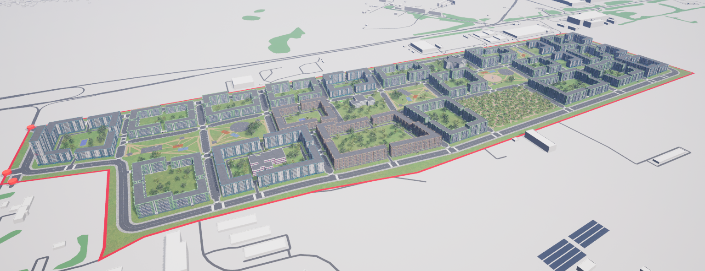
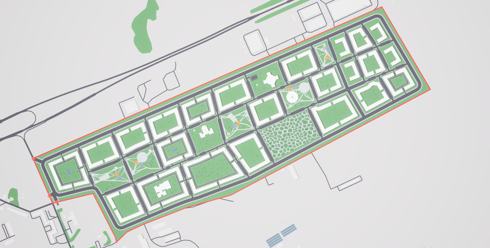

# Лаголово: Анализ данных и моделирование в урбанистике

## Описание
Данный репозиторий создан в рамках курса **"Анализ данных и моделирование в урбанистике"**. В нем представлены ключевые реализации методов пространственного анализа данных, необходимых для оценки гипотез по преобразованию территорий. 
Для исследования была взята территория Лаголовского сельского поселения в Ломоносовском районе Ленинградской области. 

**Целью** данного исследования является выбор наиболее оптимального сценария пространственного развития выбранной территории при помощи прикладных методов анализа данных, моделирования и прогнозирования. 
Для достижения этой цели необходимо выполнение следующих задач.

**Задачи**:
- выбор территории исследования;
- сбор, очистка, структуризация и восполнение геопространственных, демографических, транспортных, экономических, экологических и проч. данных, в том числе проведение социологического исследования;
- анализ градостроительной документации и приоритетов СЭР по территории;
- анализ полученных данных и результатов исследования, проведение SWOT-анализа;
- создание трёх гипотез развития территории с предполагаемыми ТЭП по каждой;
- формирование информационной модели и визуализация гипотез с помощью платформы rTim;
- оценка гипотез с помощью прикладных методов анализа данных по выбранным критериям:
  1) обеспеченность местами в детских садах и школе
  2) обеспеченность городскими сервисами разного типа (выделенными в ходе исследования)
  3) центральность кварталов.
- подведение итогов о преимуществах и недостатках каждой гипотезы;
- выбор наиболее оптимального сценария развития территории среди представленных.

## Основные библиотеки
- **pandas**: обработка и анализ табличных данных.
- **osmnx**: работа с графами дорожной сети, включая получение данных с OpenStreetMap.
- **geopandas**: обработка геопространственных данных.
- **matplotlib**: визуализация данных.
- **blocksnet**: продвинутые методы анализа пространственных данных, включая доступность и центральность.
- **iduedu**: специализированные методы для получения данных о транспортной сети и границах территорий.

## Основные методы

### 1. Получение пространственных данных
1. Выгрузка из OSM слоев с административно-территориальным делением:
- для МО (слой city): границы города, название (Name), численность населения (Population);
- для районов (слой district): границы районов, название (Name), численность населения (Population).
2. Заполнение атрибута Population по данным Росстат на 2023 год.
3. Выгрузка геометрии всех зданий, слой building:
  addr:city - город
  addr:region - регион
  addr:street - улица
  addr:housenumber – номер дома.
  * В случае нехватки актуальных данных - дорисовать геометрию и заполнить атрибуты вручную.
4. Получение координат жилых домов из реестра, сопоставить их с выгруженной ранее геометрией, добавить и заполнить атрибут is_living исходя из того, что
‘0’ – нежилой, ‘1’ – жилой.
5. Заполнение этажности жилых домов (level).
6. Восполнение населения.
7. Выгрузка сервисов в виде центроидов, если не указано иное:
- базовой инфраструктуры;
- социальной инфраструктуры;
- транспортной инфраструктуры;
- инфраструктуры обслуживания населения;
- инфраструктуры досуга;
- туристической инфраструктуры;
8. Заполнить вместимость школ и детских садов.
9. Нарезка кварталов с помощью библиотеки **blocksnet**.

**get_drive_graph**: получение графа транспортной сети для автомобилей.
- **get_walk_graph**: создание графа пешеходной инфраструктуры.
- **get_all_public_transport_graph**: сбор данных об общественном транспорте.
- **get_boundary**: определение границ изучаемой территории.

### 2. Центральность и сводные показатели
- **Centrality**: определение центральных узлов сети и ключевых путей.
- **Connectivity**: анализ связности территорий.

### 3. Доступность
- **AccessibilityProcessor**: инструменты для оценки доступности различных объектов и услуг на территории.
- **Accessibility**: пространственный анализ доступности ключевых объектов.

### 4. Обеспеченность
- **Provision** и **ProvisionMethod**: анализ плотности объектов, таких как школы, больницы и магазины, и их обеспеченности.

### 5. Прогнозирование
- **LandUsePrediction**: прогноз изменения использования земельных участков.
- **Diversity**: оценка разнообразия объектов на территории.

### 6. Визуализация
- Построение картографических визуализаций с использованием **matplotlib**, **geopandas** и **rTIM**.
Гипотеза 1:

## Структура репозитория
- **Jupyter Notebook**: основной файл с кодом для выполнения анализа.
- **Данные**: входные и выходные данные, включая географические границы, графы сетей и сервисы с процессом их отбора.
- **Документы**: нулевая гипотеза и гипотезы развития территории, их визуализация, а также сама модель
- **README**: описание репозитория и методов.

## Использование
1. Установите зависимости из `requirements.txt`.
2. Откройте Jupyter Notebook для выполнения анализа.
3. Следуйте инструкциям в ноутбуке для запуска анализа вашей территории.

## Авторы и вклад
Исследование проведено междисциплинарной командой цифровых урбанистов разного профиля.
- Беляев Александр
   Бэкграунд - география.
    Обязанности: создание модели территории в rTim, формирование репозитория GitHUB.
- Герасимова Дарья
   Бэкграунд - градостроительство.
     Обязанности: сбор и структуризация пространственных данных, формирование репозитория GitHUB, формирование отчётной презентации.
- Курохтин Игорь
   Бэкграунд - география.
    Обязанности: формулирование и создание модели территории в rTim, формулирование критериев оценки гипотез и их интерпретации.
- Станкова Алёна
   Бэкграунд - социология.
    Обязанности: сбор и структуризация пространственных данных, создание модели территории в rTim, оценка гипотез по выбранным критериям. 
- Татур Екатерина
   Бэкграунд - прикладная информатика.
    Обязанности: сбор и структуризация пространственных данных, оценка гипотез по выбранным критериям. 
- Щербинина Александра
   Бэкграунд - строительство.
    Обязанности: сбор и структуризация пространственных данных, создание модели территории в rTim, формулирование критериев оценки гипотез и их интерпретации.

## Лицензия
Данный проект распространяется под свободной лицензией. Используйте материалы в образовательных и исследовательских целях.
